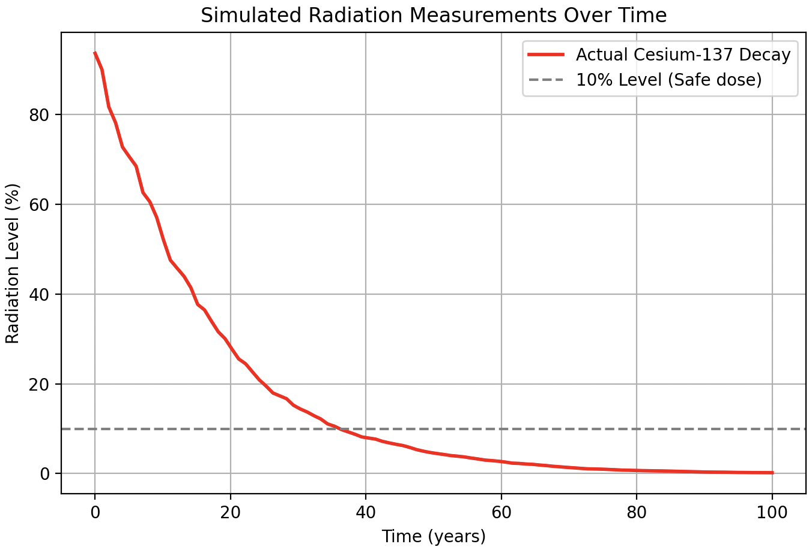

# ⚛️ Cesium Decay Simulation
## Overview
This is a small project that helps analyze how long an environment is uninhabitable after a nuclear distaster. This is **not** scientific by any means, it's just something I coded in my free time.

## How functions are generated
It starts with the base 2.6% with which Cesium Decays. Then it adds some random factor onto that decay, which can simulate the environment influencing it trough Clean-Up efforts, the soil burrying it, etc.  
The formula is recursive:
```math
\begin{align}
d &= \text{decay} \\
\Delta t &= \text{Time between measurements} \\
r &= \text{Random factor} \\
\\
N_0 &= 100 \\
N_{t} &= N_{t-1} \times (1 - d \times \Delta t \times r)
\end{align}
```
The function on a graph looks something like this:


## Usage Instructions
### 1️⃣ Installing dependencies
The project has a `requirements.txt` file, which allows installing dependencies as follows:
```
pip install -r requirements.txt
```

### 2️⃣ Running the script
Runnig the script can be done with:
```
python main.py
```
After which the script asks:
```
❯ python main.py
How often should the simulation be run?
>
```

### 3️⃣ Interpreting the output
Entering a number will run the script and yield:
```
❯ python main.py
How often should the simulation be run?
> 10
Habitability is reached after:
avg:        36.22935779816514
med:        35.82568807339449
max:        39.35779816513761
min:        34.31192660550459
std-dev:    1.5924502038408663
var:        2.5358976517128164
```
